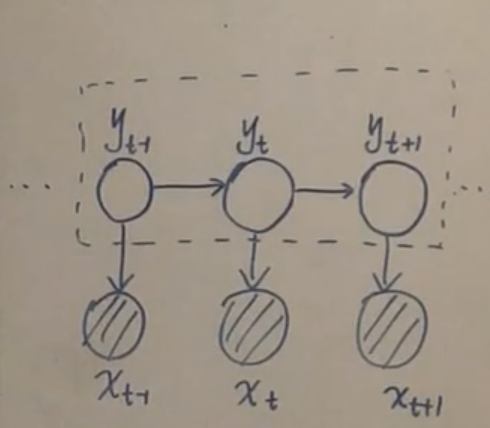

# 概率图模型 PGM

## 知识结构

## 概率图模型基础
高维随机变量 $P(x_1,x_2,\dots,x_p)$:
- 边缘概率 $P(x_i)$
- 条件概率 $P(x_j\mid x_i)$

Sum Rule: $ P(x_1) = \int P(x_1,x_2)\mathrm{d} x_2 $

Product Rule: $P(x_1,x_2) = P(x_1) \cdot P(x_2\mid x_1) = P(x_2) \cdot P(x_1\mid x_2)$

Chain Rule: $P(x_1,x_2, \dots,x_p) = \prod_{i=1}^{p} P(x_i\mid x_1,x_2, \dots,x_{i-1})$

Bayesian Rule: $P(x_2\mid x_1) = \dfrac{P(x_1,x_2)}{P(x_1)}=\dfrac{P(x_1,x_2)}{\int P(x_1,x_2)\mathrm{d} x_2} = \dfrac{P(x_1,x_2)}{\int P(x_2) \cdot P(x_1\mid x_2)\mathrm{d} x_2} $

困境：维度高，求解复杂。$P(x_1,x_2, \dots,x_p)$ 计算量太大。

假设：互相独立

Naive Bayes:

$$ P(x_1,x_2, \dots,x_p) = \prod_{i=1}^{P} P(x_i)$$

假设： Markov Property

HMM （齐次 Markov 假设）：

$$ x_j \perp x_{i+1} \mid  x_i, \quad j<i  $$

假设： 条件独立性

$$ x_A \perp x_B \mid  x_c,\quad x_A,x_B,x_C\ 是集合，且不相交$$

## 贝叶斯网络 - 条件独立性

因子分解

$$
P(x_1,x_2,\dots,x_p) = \prod_{i=1}^{p} P(x_i\mid x_{pa(i)}) 
$$

$ x_{pa(i)} $ 是 $ x_i $ 的父亲集合。

*1. tail to tail*  
若a被观测，则路径被阻塞。  
证明：  
因子分解 $P(a,b,c) =P(a)P(b\mid a)P(c\mid a)$  
链式法则 $P(a,b,c) =P(a)P(b\mid a)P(c\mid a,b)$  
消元 $P(c\mid a) = P(c\mid a,b)$   
由于 $P(c\mid a)\cdot P(b\mid a) = P(c\mid a,b)\cdot P(b\mid a) = P(b,c\mid a)$   
推出 $P(c\mid a)\cdot P(b\mid a) = P(b,c\mid a)$，即 $c \perp b \mid a$。 

*2. tail to head*  

若b被观测，则路径被阻塞。

*3. head to head*  

默认情况下，a $\perp$ b，路径是阻塞的，若 c（或其后继节点）被观测，则路径是通的。  

head to head 比较费解，举例：  
- a  酒量小
- b 心情不好
- c 喝醉 

显然 $P(a) = P(a \mid b)$。已知小明喝醉的情况下酒量小的概率 $P(a\mid c)$，明显大于已知小明喝醉且心情不好的情况下，酒量小的概率 $P(a\mid b,c)$ ，即 $P(a\mid c) > P(a\mid b,c)$，说明 a 与 b 在给定 c 时不独立。

## 贝叶斯网络 - D-Seperation

$$
P(x_i \mid x_{-i}) = \frac{P(x_i,x_{-i})}{P(x_{-i})} = \frac{P(x_i,x_{-i})}{\int_{x_i} P(x)\mathrm{d}x_i }=\frac{ \prod_{j=1}^{p}P(x_j\mid x_{pa(j)}) }{ \int_{x_i} \prod_{j=1}^{p}P(x_j\mid x_{pa(j)})\mathrm{d}x_i  }
$$

<!-- $$
= P(x_i\mid x_{pa(i)}) + P(x_{ch(i)} \mid x_i,x_{pa[ch(i)]}))
$$ -->
(马尔科夫毯)

## 贝叶斯网络 - 知识结构

## Markov Network（Markov Random Field 马尔可夫随机场）

条件独立性体现在三个方面：

$1$. Global Markov Property：如果 $A,B,C,$ 存在 $ \mathrm{Sep}(A,C\mid B)$，那么 $x_A \perp x_c \mid x_B$.

$2$. Local Markov Property：$x_i \perp {x_{-i-nb(i)}} \mid x_{nb(i)}$.

$3$. Pair Markov Property：$x_i \perp x_j \mid x_{-i-j},\quad x_i,x_j$ 没有边连接.

根据Hammesley-Clifford定理， 可得条件独立性的三种情况与基于最大团的因子分解等价 $1\Leftrightarrow 2\Leftrightarrow 3\Leftrightarrow $因子分解

> 团：一个关于节点的集合，集合中的节点之间相互都是连通的。    
最大团：一个团内不能再添加节点的团。

基于最大团的因子分解：
$$ P(x) = \frac{1}{Z} \prod_{i=1}^{K} \psi(x_{C_i}) $$
$$ Z = \sum_{x_1,x_2,\dots,x_p} \prod_{i=1}^{K} \psi(x_{c_i})$$

$C_1,C_2,\dots,C_K$: K个最大团  
$x_{C_i}$: 最大团随机变量的集合    
$Z$: 归一化因子   
$\psi(x_{C_i})$: 势函数，必须为正  

$$\psi(x_{C_i}) = \exp{\{-E(x_{C_i})\}} > 0$$

$P(x)$ 称为 Gibbs Distribution (Boltzmann Distribution)，

$$
P(x) = \dfrac{1}{Z} \prod_{i=1}^{K} \psi(x_{C_i}) = \dfrac{1}{Z} \prod_{i=1}^{K} \exp{\{-E(x_{C_i})\}} = \dfrac{1}{Z}\exp{\{-\sum_{i=1}^{K}E(x_{C_i})\}}
$$

形式上为指数族分布 

$$P(x)=h(x)\exp{\{\eta^{\mathrm{T}}\phi(x)-A(\eta) \}} = \dfrac{1}{Z(\eta)} h(x) \exp{\{{ \eta^{\mathrm{T}}\phi(x) \}}}$$

Markov Random Field $\Leftrightarrow$ Gibbs Distribution，证明略。

## Inference - 知识结构

Tasks: 给定 $P(x) = P(x_1,x_2,\dots,x_p)$ 求：

$1.$边缘概率： $P(x_i) = \sum_{x_1}\dots\sum_{x_{i-1}}\sum_{x_{i+1}}\dots\sum_{x_p}P(x)$;

$2.$条件概率（后验概率）：$P(x_A\mid x_B),\quad x = x_A \cup x_B$;   

$3.$最大后验 MAP: $\hat{z} = \arg\max_{z} P(z|x) \propto \arg\max P(z,x)$;    

HMM Inference 中的三个问题:

$1.$ Evalution 边际化: $P(O) = \sum_{I} P(I,O) \Rightarrow$ 解决方法：前向、后向；

$2.$ Learning: $\hat{\lambda}$；

$3.$ Decoding: $\tilde{I} = \arg\max_{I} P(I\mid O)$ $\Rightarrow$ Vitebi Algorithm(动态规划).

HMM $\Rightarrow$ Dynamic Bayesian Network

## Inference - Variable Elimination 变分推断
(VE的核心思想：乘法分配律)

$$
P(d) = \sum_{a,b,c} P(a,b,c,d) = \sum_{a,b,c}P(a)P(b\mid a)P(c\mid b) P(d\mid c)
$$
$$
= \sum_{b,c} P(c\mid b)P(d\mid c) \underbrace{\sum_a P(a)P(b\mid a)}_{\phi_a(b)} 
= \sum_{c} P(d\mid c) \underbrace{\sum_b P(c\mid b) \phi_a(b)}_{\phi_b(c)}= \phi_c(d)
$$

推广到无向图，$K$ 是最大团的个数： 

$$P(a,b,c,d) = \dfrac{1}{Z}\prod_{i=1}^{K}\phi_{C_i}(x_{Ci})$$

由于是最大团，不能再添加其他结点，因此团与团的联系较小，同时每一个结点几乎不可能同时存在于所有团，因此同样可以使用Variable Elimination方法进行计算。

因此，可以用因子乘积 
$$P(x) = \prod_{x_c}\phi_c(x_c)$$